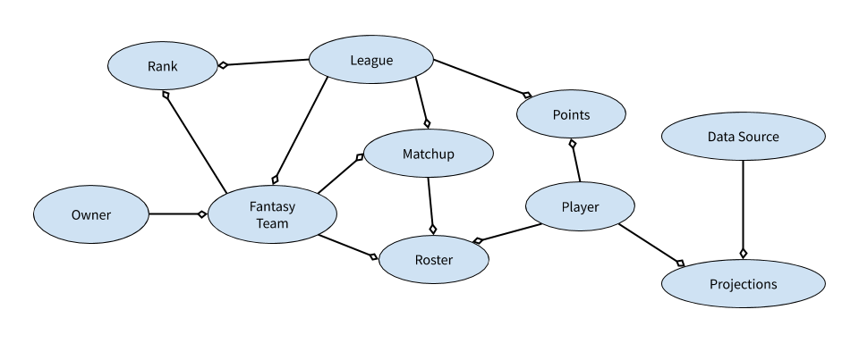
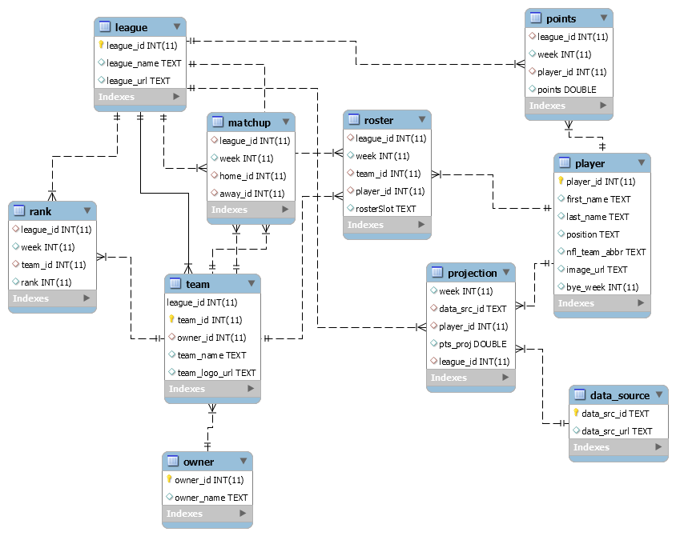

# Introduction

The final assessment for course 1 is peer-graded. While it won’t incorporate every idea we’ve covered in the course, it will include key elements from each of Modules 1 through 4 in one integrated exercise.

The assessment has four parts:

* **Conceptual business model**. You’ll construct a conceptual business model similar to the one we discussed in Module 1.
* **Relational data model**. You’ll then design a simple relational data model to represent some of the ideas from your conceptual model (like in Module 2), and describe what types of systems you think the data might come from (Module 1).
* **SQL queries**. You’ll write two SQL queries to extract an interesting data set from your data model (Module 3)
* **Sensitive data and data quality issues**. Finally, you’ll identify whether your model contains certain types of sensitive data, and assess where your model might be susceptible to data quality issues (Module 4).


```{r setup, warning=FALSE, echo=FALSE, message=FALSE}

# creating tables
library(dbplyr)
library(DBI)

# connection to sql proxy
con <- DBI::dbConnect(RMariaDB::MariaDB(),
                      host="127.0.0.1",
                      user="root",
                      password=rstudioapi::askForPassword("Database Passaport"),
                      dbname="assign01")

```

# Part 1: Conceptual Model

## Instruction

Conceptual business model. Construct a conceptual business model for an industry or business that you are familiar with or have interest in. Visually it should be similar to the one we illustrated in Module 1, Video 2.

* Your model should represent at least 10 ideas
* It should visually represent one to one, many to one, or many to many relationships among ideas

## Conceptual Model

For this exercises I used the [NFL Fantasy](https://fantasy.nfl.com/) as conceptual and data models. [Fantasy football](https://en.m.wikipedia.org/wiki/Fantasy_football_(association)) is a game in which participants assemble an imaginary team of real life footballers and score points based on those players' actual statistical performance or their perceived contribution on the field of play. Usually players are selected from one specific division in a particular country, although there are many variations. The original game was created in England by Bernie Donnelly on Saturday 14 August 1971 and is still going strong 45 years later. Check [this reference](https://en.m.wikipedia.org/wiki/Fantasy_football_(association)) to know more about it. 



### Explaining the entities

* **League**: it's a set of fantasy players that join to build teams and play a championship between them.
* **Owner**: it's the fantasy player member of a league that owns one team
* **Fantasy Team**: it's the team in the league, owned by a fantasy player
* **Matchup**: It's the set of matchs between teams in a league, each team plays once a week.
* **Roster**: It's the lineup of football players for each team in a week.
* **Player**: It's the set of football players.
* **Points**: It's the weekly point record of each player of a league
* **Projection**: It's the "prediction" of each weekly player score.
* **Data Source**: It's the web site that make weekly "prediction" about players score.

# Part 2: Relational data model. 

## Instruction

Take a subset of the ideas from the conceptual model you constructed in Part 1 and design a simple relationship model similar to the ones we discussed in Module 2, Video 4

* Your model should have at least 5 tables
* You should include at least 20 attributes, or fields, in your model (20 total across all tables, not per table)
* Your model should be normalized
* Identify the primary key in each table, and state whether it is a natural or surrogate key
* For each relationship between tables, identify any foreign keys needed to define the relationship
* For each table, identify what type of system or systems you think the data might come from, like those we discussed in Module 1, Video 6.

## Relational Data Model



### Keys

The relational data model is pretty straightforward with respect the conceptual model, e create 10 tables with 42 fields, including the key. The model is normalized, for each table the key are:

| Table          | Key(s)         | PK/FK       | Type          |
|----------------|----------------|-------------|---------------|
| League         | league_id      | PK          | surrogate     |
| Team           | team_id        | PK          | surrogate     |
| Owner          | owner_id       | PK          | surrogate     |
| Player         | player_id      | PK          | surrogate     |
| Datasource     | data_src_id    | PK          | surrogate     |
| Rank           | league_id, team_id, week | FK | composite |
| Matchup        | league_id, home_id, away_id, week | FK | composite |
| Roster         | league_id, team_id, week, player_id | FK | composite |
| Points         | league_id, player_id, week | FK | composite |
| Projection     | data_src_id, league_id, player_id, week | FK | composite |

### Relationships

The relationship are explicit in the model, that the follows the standard [Entity-Relationship Diagram Notation](https://www.lucidchart.com/pages/ER-diagram-symbols-and-meaning)


Worth to note that the in the **matchup** table, the teams that will play in this match are named as *home_id* and *away_id* for home and visitors team, this fields are the *team_id* in the **team** table, so one match always has two teams.

### Sources 

We can imagine 3 diferente type os "sources" from this info, the Fantasy Game itself, the actual NFL game stats and the internet for poinst predictions, with each table coming from:

| Table          | System Source  |
|----------------|----------------|
| League         | Fantasy Game   |
| Team           | Fantasy Game   |
| Owner          | Fantasy Game   |
| Player         | NFL Stats      |
| Rank           | Fantasy Game   |
| Matchup        | Fantasy Game   |
| Roster         | Fantasy Game   |
| Points         | NFL Stats      |
| Datasource     | Internet       |
| Projection     | Internet       |

#### Understanding data_source and projection tables

These tables makes part of a "prediction system", the table **data_source** tells witch internet web site has NFL Players Prediction that can be used by a Fantasy Player choose and lineup Football Players. Let's see the table content.

```{sql connection=con}
select * 
from data_source
```

As we see, each record of the table **data_source** is a diferent website projection provider. Now let's look part of the **projection* table, who stores the weekly projected score for each player made by each website provider.

```{sql connection=con}
select pr.league_id, pr.week, pr.data_src_id, pr.pts_proj, pl.first_name, pl.last_name, pl.position, pl.nfl_team_abbr
from projection pr
inner join player pl
on pl.player_id=pr.player_id
order by pl.player_id desc, week asc, data_src_id asc
limit 15
```


# Part 3: SQL queries. 

Using the data model you constructed in Part 2, come up **with two data extracts** you think would be interesting, then write SQL queries to provide each one.

* For each query, state what data you are trying to get and why it would be interesting
* Provide the SQL query using the commands and syntax we learned in Module 3
* For maximum credit, at least one of your queries should involve a join across two or more tables.

## Queries: Week Matchup Result

As first query, let's find which team won and what score they have in a specific week (5 for example) in the fantasy league. To do so, we'll have to join the **roster** of each **team** in that week with the individual **player'a points**, sum then up to find the team's score and compare with the opponent team score.

For this exercise we'll use, data extract from my **league**, named "It's football, dudes", which I extract the data from Fantasy website.

```{sql connection=con}
-- what are the league_id?
select *
from league
```

There is only one league in the data set, we'll use it's code: 3940933. Let's make this in two steps, first let's find which teams plays against each other in the week 5.

```{sql connection=con}
-- from the matchup
select
	m.league_id, 
	m.week, 
  m.home_id, 
  hmt.team_name as home_team_name, 
  m.away_id, 
  awt.team_name as away_team_name
from matchup m
-- join the home team with team table
inner join team hmt on hmt.team_id = m.home_id
-- joint the visitor team with team table
inner join team awt on awt.team_id = m.away_id
-- week 5 on the league of interest
where m.week=5 and m.league_id=3940933;
```

Now we know what are the matchups for week 5, let's calculate each team's score in that week, to do this we join the roster of each team with the individual players points and sum up in a team score.

```{sql connection=con}
-- week team total score
select league_id, week, team_id, sum(points)
from (
	-- join roster with points to get individual player's points in the rosters
	select r.league_id, r.week, r.team_id, r.player_id, r.rosterSlot, p.points
	from roster r inner join points p 
	on r.league_id=p.league_id and r.week=p.week and r.player_id=p.player_id
) roster_points
-- exclude players in the bench, their pontuation don't count as team points
where rosterSlot != "BN" and week=5 and league_id=3940933
group by league_id, week, team_id;
```

Now, let's up all toghether.

```{sql connection=con}
-- round results query
select
    hmt.team_name as home_team_name, 
    htpts.total_points as home_team_points,
    awt.team_name as away_team_name,
    awpts.total_points as away_team_points
from matchup m
-- to get tha names of home and visitor teams
inner join team hmt on hmt.team_id = m.home_id
inner join team awt on awt.team_id = m.away_id
-- score for home team
inner join (
	select league_id, week, team_id, round(sum(points),1) as total_points
	from (
		-- join roster with points to get individual player's points in the rosters
		select r.league_id, r.week, r.team_id, r.player_id, r.rosterSlot, p.points
		from roster r inner join points p 
		on r.league_id=p.league_id and r.week=p.week and r.player_id=p.player_id
	) roster_points
	-- exclude players in the bench, their pontuation don't count as team points
	where rosterSlot != "BN"
	group by league_id, week, team_id
) htpts on m.league_id=htpts.league_id and m.week=htpts.week and hmt.team_id=htpts.team_id
-- score for visitor team
inner join (
	select league_id, week, team_id, round(sum(points),1) total_points
	from (
		-- join roster with points to get individual player's points in the rosters
		select r.league_id, r.week, r.team_id, r.player_id, r.rosterSlot, p.points
		from roster r inner join points p 
		on r.league_id=p.league_id and r.week=p.week and r.player_id=p.player_id
	) roster_points
	-- exclude players in the bench, their pontuation don't count as team points
	where rosterSlot != "BN"
	group by league_id, week, team_id
) awpts on m.league_id=awpts.league_id and m.week=awpts.week and awt.team_id=awpts.team_id
-- just from week and league of interest
where m.week=5 and m.league_id=3940933
order by home_team_points desc
```

Finally we get the round *5* of league *3940933*, with the names of the teams and the score marked for each team.

# Part 4: Sensitive data and data quality issues. 

Consider the data privacy and data quality implications of the data model you constructed in Part 2.

* Identify any fields you think might be PII, CFI, CPNI, or PHI as we defined in Module 4, Video 4
* What data elements in your model will present the most significant data quality challenges? Explain your reasoning.
