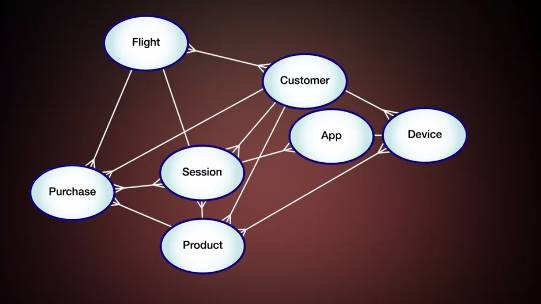
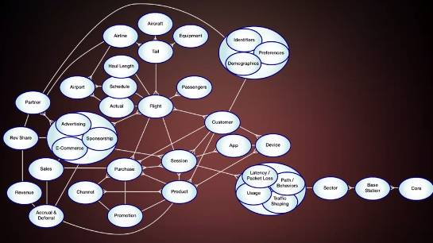

# Analysis Workflow

## Think Backwards
+ Start with the decision you want to make
+ Consider the information needed to make that decision

## Start with the decision you want to make
+ Will an analysis influence the decision?
+ Does the choice matter?

## Consider the information needed to make that decision
+ What would the analysis outputs look like?
+ What methods & tools are needed?
+ Where will the data come from?
+ Is there enough time?

## Define the decision to be made
+ Determine what outputs would help make that decision
+ Design the analysis that creates those outputs
+ Get the data needed for the analysis
+ Execute the analysis

# Information-Action Value Chain

Real-World Events & Characteristics > Take Action

+ Real-World Events & Characteristics
+ System Data Capture
+ Accessible Location/Storage
+ Data Extaction for Analysis

Descriptive Analytics > Predictive Analytics > Prescriptive Analytics

+ Summarize & Interpret Results
+ Develop Strategic & Plan
+ Deliver the pitch
+ Take Action

# Business Context

A **conceptual business model** is a diagram that illustrates how an industry or business functions. It shows important elements in the business, and maps out how those elements relate to each other.

Some of these relationships are defined by physical realities in the world. Others are the result of business decisions we make. Going through the process of mapping this out illustrates our understanding of the business and helps us see how certain types of events may influence other types of events.

As you can imagine, these diagrams can get a bit complicated. Chances are you won't be able to sit down and map all this out on day one. That's okay. You can start with the basic elements and revise your model over time, as you learn more and more about the business. 

As a data analyst, you'll be working with data that describes all the things in your diagram. So it seems natural to start to look at each element and wonder where the information about that element comes from, and start to determine whether you have the ability to link things together in the same way, using that data.

# The information-Action Value Chain

While the analysis itself might be the most interesting part of the job, the reality is a good part of your time and energy will probably be spent on activities that happen upstream and downstream of the math. The better you are at understanding the value of each step, the more effective you will be as an analyst. The way we illustrate this idea is through a framework we call the information-action value chain.

Value Chain: starts with events or characteristics in the real world, and ends with an action in the marketplace

## Upstream

1. **Identify Real-World Events** and its Characteristics
1. **System Data Capture**: identify datasources and how to capture the event
1. **Accessible Location/Storage**: bring data to a accessible location
1. **Data Extaction for Analysis**: getting a manageable data set that you can use in analytical applications

We realize that everything starts with events or characteristics in the real world. We talked about how those events need to be captured by source systems and turned into data. We learned how data from source systems can be brought together into one common location for access and storage. Finally we saw the need to be able to extract only the data we need for analysis.

## Tree types of analytics

Descriptive Analytics, Predictive Analytics and Prescriptive Analytics.

### Descriptive Analytics

**Descriptive Analytics** as its name suggests, helps us describe what things look like now or what happened in the past. The idea of course is to use that information to better understand the business environment and how it works. And to apply that knowledge along with business acumen to make better decisions going forward. Descriptive Analytics can take the form of simple aggregations or cross tabulations data. Simple statistical measures like means, medians, and standard deviations. More sophisticated statistics like distributions, confidence intervals and test of hypotheses or advanced association or clustering algorithms.

### Predictive Analytics

**Predictive Analytics** help us take what we know about what happened in the past, and use that information to help us predict what will happen in the future. This almost always involves the application of advanced statistical methods or other numeric techniques such as linear or logistic regression. Tree based algorithms, neural networks and simulation techniques such as Monte Carlo simulation.

### Prescriptive Analytics. 

This type of analysis helps explicitly link analysis to decision making by providing recommendations on what we should do or what choice we should make to achieve a certain outcome. It usually involves the integration of numerical optimization techniques with business rules and even financial model.

## Downstream

1. **Summarizing and interpreting the results**:  summarizing an analysis usually involves identifying a few charts, graphs or tables, make it as easy as possible to see what's going on and supplementing those figures with a short narrative. It's also when you determine whether you have successfully answered the question you intended to answer.
1. **Develop Strategy & Plan**:  Normally, this involves setting a high-level strategy, then developing specific actions or tactics that I can take to achieve some sort of outcome. I might develop multiple alternatives and weigh the pros and cons of each. I might even develop a financial model or run a follow on decision analysis to help me assess each option. In our customer cancellation example, the desired outcome is simple. I'd like customers to stick around and not cancel their service.
1. **Communicate the results**: No matter how good your analysis is and no matter how promising your plan is. There's a good chance you'll get no where fast if you can't effectively communicate your results and sell your proposal. 
1. **Take action**

# Data Sources

## People

+ Demographics
+ Psychographics
+ Technographics
+ Events
+ Identifiers
+ Physical Location
+ Online Location
+ Transactions
+ Consumption or Usage
+ Interactions

## Objects & Environment

+ Physical & Functional Characteristics
+ Location & Movement
+ Actions & Events
+ Natural Phenomena
+ Non-Natural Events

## Key Systems

+ Core Enterprise Systems
+ Customer & People Systems
+ Product & Presence Systems
+ Technical Operations Systems
+ External source systems

### Core Enterprise Systems

+ Billing & Invoicing Systems
+ Enterprise Resource Planning (ERP) Systems
+ Supply Chain Management Systems
+ Accounting Systems
+ Usage Tracking Systems

### Customer & People Systems

+ Customer Relationship Management (CRM) Systems
+ Customer Care Systems
+ Lead Management / Sales Force Automation Systems
+ Campaign Management Systems
+ Human Resource Systems
+ Electronic Health / Medical Records

### Product & Presence Systems

+ Product Management Systems
+ Content Management Systems
+ Web Management & Analytics Systems

### Technical Operations Systems

+ Process Monitoring Systems
+ Alarming & Fault Monitoring Systems
+ Ticketing & Workflow Management Systems
+ Telematics & Machine Data Processing Systems

### External source systems

+ Credit Agencies
+ Demographics & Segmentation Providers
+ Partners & Suppliers
